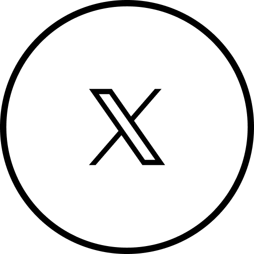

  <h3>👋 Hi, I'm Inder</h3>
  <h4>💻 Senior iOS Developer (Swift | SwiftUI | Flutter | React Native)</h4>
  <h4>Welcome to my GitHub Profile!</h4>
  
I am a self-taught iOS developer from India with years of experience in designing, coding, and publishing mobile applications for Apple & Android devices, including iPhone and iPad.My expertise lies in Swift, SwiftUI, Combine, and the MVVM architecture, and I have a strong passion for creating intuitive and engaging user experiences.

  
Feel free to connect with me for any potential collaborations or freelance opportunities.

  &nbsp;
  &nbsp;
  &nbsp;
  

<!--
#### 👨🏻‍💻 [Github Portfolio](https://github.com/InderJagdeo/iOS-Developer-Portfolio)

&nbsp;

**InderJagdeo/InderJagdeo** is a ✨ _special_ ✨ repository because its `README.md` (this file) appears on your GitHub profile.

Here are some ideas to get you started:

- 🔭 I’m currently working on ...
- 🌱 I’m currently learning ...
- 👯 I’m looking to collaborate on ...
- 🤔 I’m looking for help with ...
- 💬 Ask me about ...
- 📫 How to reach me: ...
- 😄 Pronouns: ...
- ⚡ Fun fact: ...
-->
